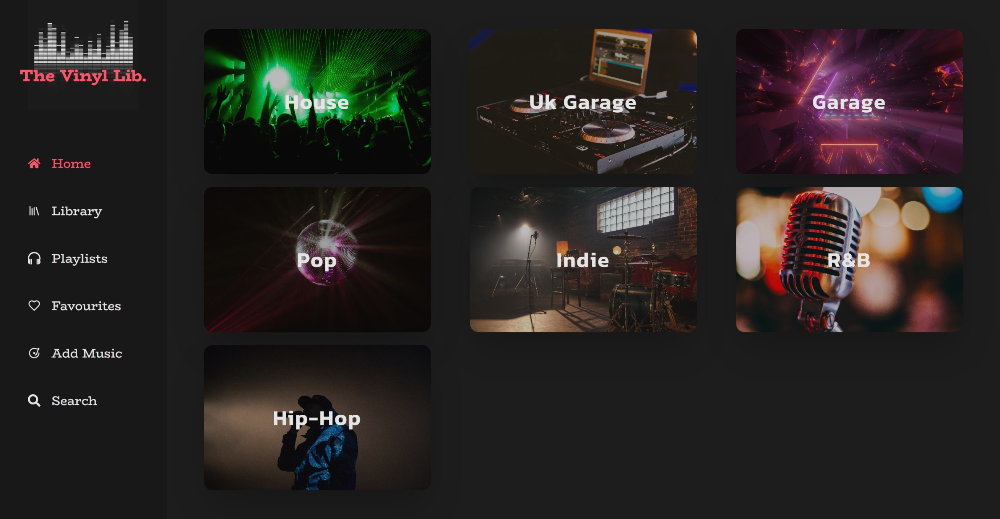
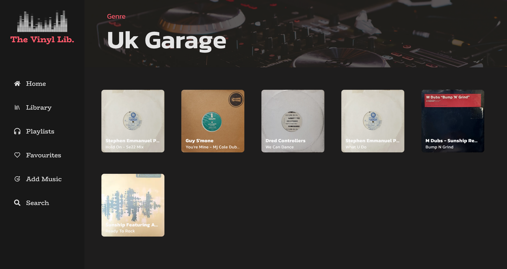
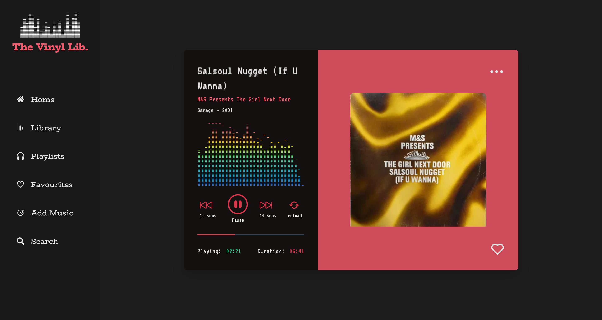
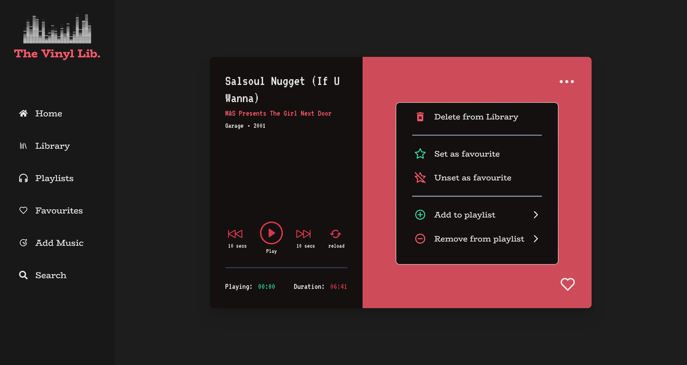
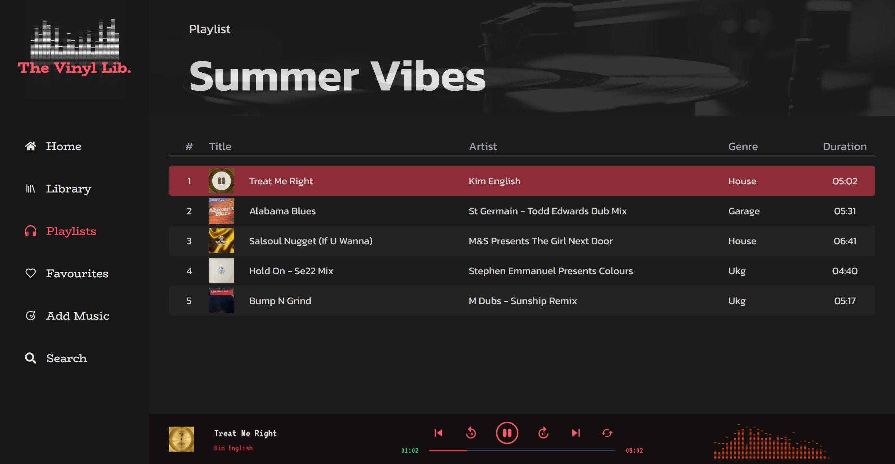
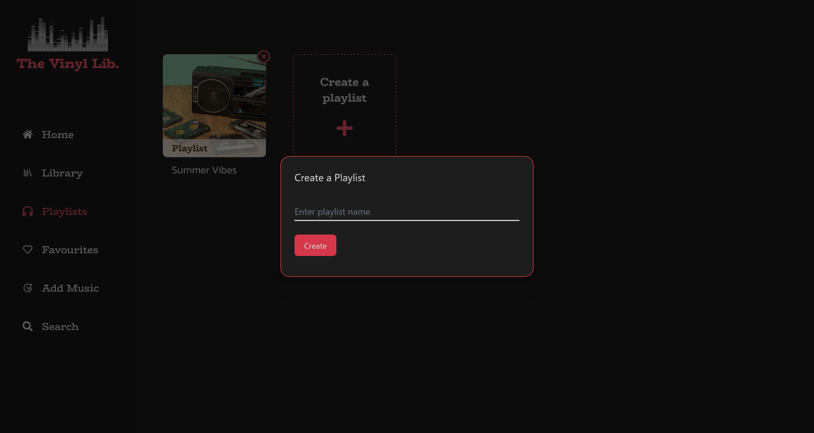
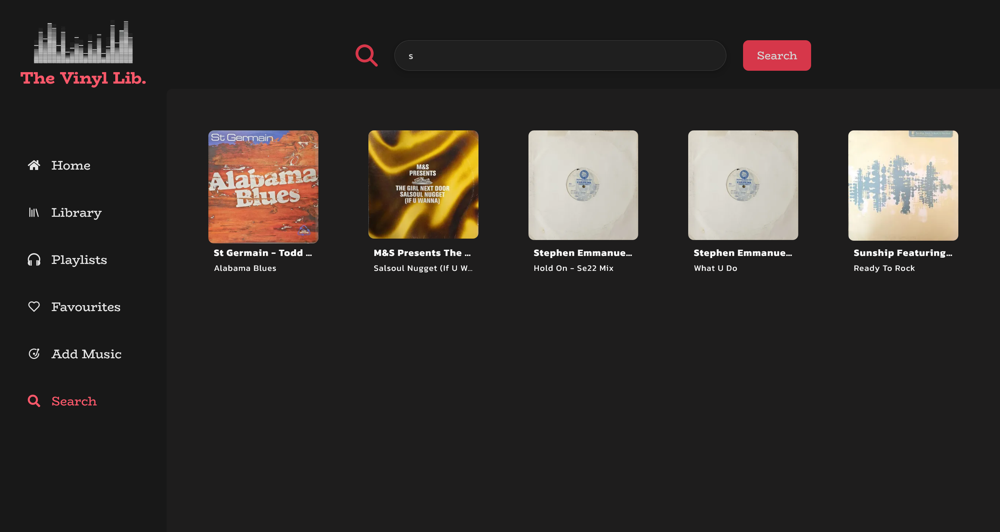

# Music Player Library</span>

#### Getting started

```npm run dev```

---

Note: &nbsp; for demo purposes disabled creating playlists, form submission & use of cloudinary widget (due to automatic upload - replaced `CloudUpload component` with normal button). Able to add/remove from playlists/favourites to demo functionality.

- To use add a `.env` file with your own cloudinary & database credentials.

---

Click link to see demo of the project: &nbsp; &nbsp; **[The Vinyl Lib.](https://my-vinyl-library.vercel.app/)**.

### Problem

How to make my vinyl **analogue** record music collection available to interact with, in a **digital** way.

### Solution

Created a full stack web app music player inspired by online streaming players like mixcloud/itunes to organise and upload music, play tracks and create playlists.

## Tech

- Next JS
- React
- Tailwind CSS
- react icons
- framer motion - (css transitions/animations)
- audiomotion-analyzer
- React hook form
- yup resolver - form validation
- react toastify - toast notification
- plaiceholder pkg for generating image placholders
- NextCloudinary & Cloudinary- image/audio upload cloud server
- SQL database - PostgreSql (cloud service - vercel postgres)

## Functionality

1. library tracks organised via music genres

2. search functionality via artist or track name using  Next router.push() with *url search query/term* e.g. '<http://vinyl-lib.com/search?term=sun>'

3. navigation using NextJS  `<Link>` component and `useRouter()`

4. able to add tracks to a favourites lists

5. make playlists - add/remove tracks

6. Form - add music to database library with form validation.

    - enter track info using multi-step form
    - upload track vinyl cover image and audio using cloudinary upload widget

7. music player - created using `<audio>` element

    - with play, pause, seek and reload functions
    - Visual progress bar song duration
    - using *'audioMotion-analyzer'* to show EQ function of playing audio

8. image placeholders for better ux/ui using plaiceholder

9. BACKEND
    - Postgresql database for storing track information
    - used *sql template string* for making parameterized queries - easier readability - with joins & foreign keys
    - CRUD functionality with API routes
    - Asset (image/audio) storing & retrieval using Cloudinary service

---

## Screenshots

</br>
</br>

</br>
</br>

</br>
</br>

</br>
</br>

</br>
</br>

</br>
</br>

</br>
</br>

